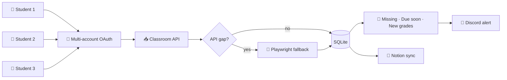

# Google Classroom Scraper

A Playwright + Google API pipeline that pulls assignments, due dates, and grade data from Google Classroom across multiple students and courses into a unified local dashboard, with Discord alerts and Notion sync.

> *This repo is a public overview. The running code is private.*

---

## What it is

Google Classroom works fine for a teacher managing one class. It's painful for a parent tracking multiple students across a dozen courses. This tool aggregates everything into one place — all assignments, all due dates, all grade changes — with alerts that surface the stuff that actually needs attention.

## What it does

- **Authenticates each student account** via stored Google OAuth tokens
- **Enumerates every enrolled course** and pulls assignment metadata, due dates, submissions, and grades
- **Merges across students** so a parent sees everyone's workload in one pane
- **Detects "the stuff that matters"** — missing assignments, upcoming due dates, new grades posted, overdue work
- **Alerts to Discord** and **syncs the full dataset to Notion** for mobile access

## Architecture

## Software

| Layer | Tech |
|---|---|
| Auth + API | Google OAuth 2.0, Google Classroom API |
| Fallback scraping | Playwright (for UI-only data) |
| Storage | SQLite (local), Notion (sync target) |
| Alerts | Discord webhooks |
| Scheduling | `launchd` |

## What this demonstrates

- **Multi-account OAuth handling** — token storage, refresh, scope management across users
- **Hybrid API-plus-scraping architecture** — use the official API where it works, fall back to UI scraping where it doesn't
- **Aggregation pattern** — turning per-user data into a household-level dashboard

## Stack

## Related in the AIOS Portfolio

- **[PowerSchool Scraper](https://github.com/mikecutillo/powerschool-scraper)** — Sibling tool; Playwright PowerSchool gradebook extractor with rules-engine alerts
- **[BMO Discord Agent](https://github.com/mikecutillo/bmo-discord-agent)** — Discord-native family AI companion; the alerts channel for missing or late assignments
- **[AIOS](https://github.com/mikecutillo/aios)** — The host; Next.js dashboard orchestrating 16+ household and business modules

---

Part of the AIOS portfolio. See the [profile README](https://github.com/mikecutillo) for the full system map.
